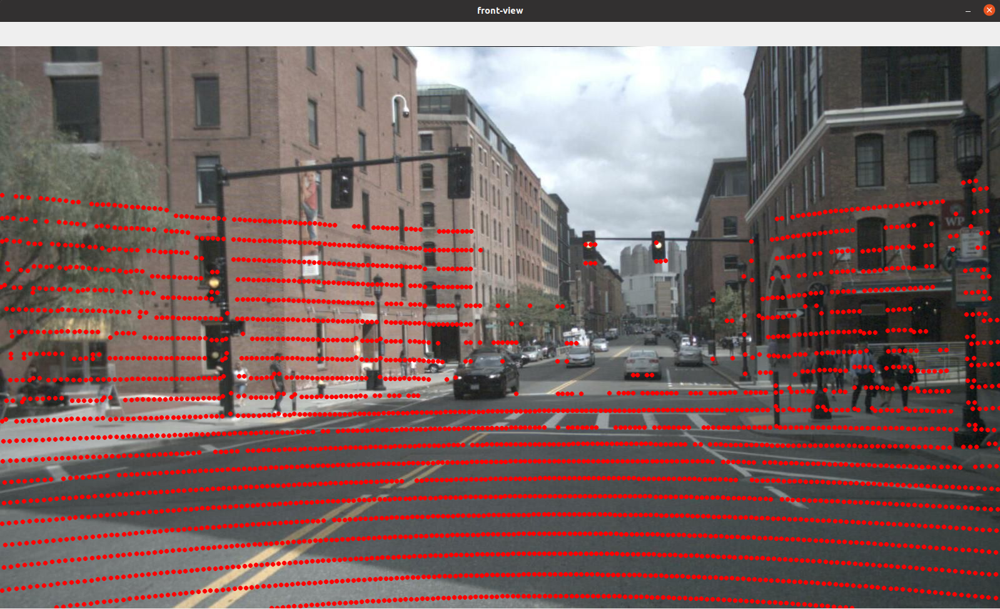
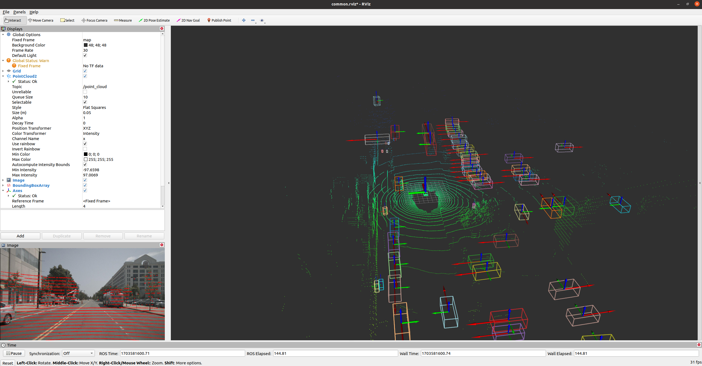

# nus数据集转kitti格式

+ nus转正常的kitti格式(标注还是常规雷达系，原始kitti标注是基于相机系), **可以直接参考第7小节**

+ 只用kitti形式保存数据,主要是人看更直接
+ 标注的参考坐标系还是使用常规的雷达系，不使用kitti原始的的相机系,因为自己标注的框都是基于lidar系生成,没必要再转到kitti使用的相机系

+ 这里强调一下**常规雷达系**(右手拿出来比划，x前, y左, z上)
+ 重要事情说3遍：**常规雷达系 右手比划一下，右手比划一下，右手比划一下**

# 1 依赖

+ 基本依赖：ros1环境和一个能运行mmdet3d工程的python环境
+ 没有ros环境,可以只运行`nus2common.py`代码, 不进行点云可视化, 快速实现直接参考本章第7小节内容

~~~python
# 记得切一个能运行BEVFusion，fastbev，bevdet，mmdetetion3d的python虚拟环境运行该工程
# 报错需要什么库就编译什么库

# 1 激活自己的虚拟环境 本人使用bevdet
conda activate bevdet

# 2 安装依赖包 
pip install pyyaml nuscenes-devkit python-opencv pypcd 

# 3 安装ros发布box的依赖  需要ros可视化才需要安装
pip install pyyaml rospkg empy catkin_pkg
sudo apt install ros-noetic-jsk-recognition ros-noetic-jsk-rviz-plugins

# 4 创建工作空间
mkdir -p nus2kitti_ws/src && cd nus2kitti_ws/src

# 5 拉取源码
git clone https://github.com/linClubs/nuscenes2kitti.git

# 6 编译
cd nus2kitti_ws && catkin_make

# 7 运行时报错
ModuleNotFoundError: No module named 'cStringIO'
# 修改如下 python3中StringIO是从io导入
try:
    from cStringIO import StringIO

    from io import StringIO
~~~

+ 发布box消息

~~~python
# 1. 只发布前视图和点云
roslaunch nus_pkg nus_pub_cloud.launch

# 2. 发布环视,点云, 3Dbox
roslaunch nus_pkg nus_pub_box3d.launch

# 3 nus2kitti
rosrun nus_pkg nus2kitti.py
# 或者
cd nus_pkg/scripts
python nus2kitti.py
~~~

# 2 坐标系介绍

+ nus中的雷达系为右手系，x向右，y向前，z向上
+ 原始token中3D的标注框是基于world系的。
+ 使用`nusc.get_sample_data`该`api`返回的`box`是在当前传感器下
~~~python
from nuscenes.nuscenes import NuScenes 
nusc = NuScenes(version='v1.0-mini', dataroot=dataroot, verbose=True) # 读取数据集
# 使用的lidar_token, 所以3Dbox是lidar系下
lidar_path, boxes, _ = nusc.get_sample_data(lidar_token)
~~~

# 3 mini-nus数据

1. 3D标注类别
~~~python
# 13类
nus_categories = ['barrier', 'bicycle', 'bicycle_rack', 'bus', 'car', 
                  'construction', 'debris', 'motorcycle', 'pedestrian', 'pushable_pullable', 
                  'trafficcone', 'trailer', 'truck']
~~~

# 4 标准的lidar系

[坐标系定义参考](https://mmdetection3d.readthedocs.io/zh-cn/latest/user_guides/coord_sys_tutorial.html)

1. 常规的lidar坐标系，满足右手系，当x向前，y向左，z向上，与nus差了yaw=90°
2. opendet3d和mmdetection3d框架都是统一坐标系，使用常规的lidar坐标系

3. 3D标注容易搞混，但mmdetection3d统一了。使用7维的量表示
+ 都以box自身中心为原点, 运动方向为x方向的右手系，确定x,y,z,dx,dy,dz
+ yaw角box运动方向与常规lidar系(x向前)的y轴负方向的夹角(就是水平的夹角), 绕z的逆时针转为正
+ 如果box运动方向为y轴负方向, 即yaw=0°，box运动方向为x轴，即yaw=90°
+ 这里不考虑pitch和roll角, 通常深度学习使用的数据集都只使用了yaw角

~~~python
x, y, z, dx, dy, dz, yaw
~~~

+ 这样定义的好处：
    + 用户不用再考虑到底wlh还是lwh顺序, yaw角的正负
    + 用户不用再考虑中心点是3d框的几何中心还是底面中心

4. nus中标注，默认的box的wlh对应是dy，dx，dz, 注意dy，dx，dz的顺序
5. kitti中标注：
    转向角 (yaw) 的参考方向为 y 轴正方向, 即box运动方向为y轴时，yaw=0°
    尺寸为(w, l, h)对应 dy，dx，dz

## 4.1 nus标注数据变换到统一坐标系下

box的值需要绕z轴旋转90°即可。
+ 由于box的dx, dy, dz是以自身为参考系，如果变换过程中值保持不变，
+ 只需要将x, y, z,yaw旋转90°即可

# 5 自制3D数据集

[参考](https://mmdetection3d.readthedocs.io/zh-cn/latest/advanced_guides/customize_dataset.html)

1. 坐标系
 采用统一的坐标系即可，即右手系，x前，y左，z上

2. 点云
+ 采用bin格式
+ 注意点云维度xyzi,xyz,xyzit

~~~python
import numpy as np
from pypcd import pypcd

# pypcd库将pcd转bin
pcd_data = pypcd.PointCloud.from_path('point_cloud_data.pcd')
points = np.zeros([pcd_data.width, 4], dtype=np.float32)
points[:, 0] = pcd_data.pc_data['x'].copy()
points[:, 1] = pcd_data.pc_data['y'].copy()
points[:, 2] = pcd_data.pc_data['z'].copy()
points[:, 3] = pcd_data.pc_data['intensity'].copy().astype(np.float32)
with open('point_cloud_data.bin', 'wb') as f:
    f.write(points.tobytes())
~~~

3. 图像
+ 采用png格式

4. 标注信息

+ 标注数据采用`x, y, z, dx, dy, dz, yaw categories`的txt文件，跟kitti标注类似
+ txt比json简单文件内容简单一点，内容不会出现dict包dict

~~~python
# 格式：[x, y, z, dx, dy, dz, yaw, category_name]
1.23 1.42 0.23 3.96 1.65 1.55 1.56 Car
3.51 2.15 0.42 1.05 0.87 1.86 1.23 Pedestrian
~~~

5. 传感器外参
因为涉及多个传感器, 需要传感器直接的标定参数

---

6. 自定义数据目录如下：

~~~python
mmdetection3d
├── mmdet3d
├── tools
├── configs
├── data
│   ├── custom
│   │   ├── ImageSets
│   │   │   ├── train.txt
│   │   │   ├── val.txt
│   │   ├── calibs
│   │   │   ├── 000000.txt
│   │   │   ├── 000001.txt
│   │   │   ├── ...
│   │   ├── images
│   │   │   ├── images_0
│   │   │   │   ├── 000000.png
│   │   │   │   ├── 000001.png
│   │   │   │   ├── ...
│   │   │   ├── images_1
│   │   │   ├── images_2
│   │   │   ├── ...
│   │   ├── labels
│   │   │   ├── 000000.txt
│   │   │   ├── 000001.txt
│   │   │   ├── ...
~~~

# 6 疑问

1. nus标注数据变换到统一坐标系下, 是将box信息绕z轴逆时针旋转90°，因为是正的90°
但在代码里nus_pub_box3d.py中152行左右是给的-1.57(-90°)，可视化才满足实际情况
+ 该问题已解决，一个是点变换(框旋转正90度)，一个做坐标系的变换(-90度) 

2. bevfusion与mmdetection3d工程中`./tools/dataset_converters/nuscenes_converter.py`的nus_categories变量只给了10类, 实际统计nusc.get的api统计出来13类 ,删掉了3个类别

~~~python
# nuscenes_converter.py中
nus_categories = ('car', 'truck', 'trailer', 'bus', 'construction_vehicle',
                  'bicycle', 'motorcycle', 'pedestrian', 'traffic_cone', 'barrier')

# 根据 下面函数统计出来有13类
category_name = nusc.get("sample_annotation", token)['category_name'].split('.')[1]

nus_categories = ['barrier', 'bicycle', 'bicycle_rack', 'bus', 'car', 
                  'construction', 'debris', 'motorcycle', 'pedestrian', 'pushable_pullable', 
                  'trafficcone', 'trailer', 'truck']                
~~~

# 7 nus转kitti保存格式

+ kitti的目录结构比较人看比较直观, 所以可以使用kitti的目录结构制作数据集

## 7.1 nus坐标系转常规的lidar系nus2common.py

+ 点云信息：`nus`的坐标系（右手`x`右） -> 常规的坐标`lidar`系 `x`向前
+ 标注信息：`nus`是相对于`world系` -> 转换到正常的`lidar`系 ， $T_{(-90°)} * T_{\_lidar\_world}$
+ `nus2common.py`中`137`行左右，坐标系旋转`-90`°

+ `lidar`数据和标注框信息都是**基于正常的lidar系(右手系x向前，y向左，z向上)**, 标注:`x y z dx dy dz yaw`
+ 传感器标定参数注意nus-lidar系已变成常规的lidar系, 主要是外参$T_{\_cam\_lidar}$

+ 没有ros环境的使用`nus2common.py`代码即可

~~~python
# 1 启动nus2common.py 不需要ros环境
# 只opencv可视化相机前视图并将点云投影到前视图上显示
# 主要配置nus2common.py中dataroot与saveroot路径
cd scripts
python nus2common.py

# 2 使用roslaunch启动 需要ros环境
# 使用ros-rviz可视化 发布常规lidar系下的点,相机前视图 以及点云的3Dbox, 
# 主要配置nus2common_ros.launch中dataroot与saveroot路径, 修改nus2common_ros.py第一行的python环境 
roslaunch nus_pkg nus2common_ros.launch

'''
bicycle_rack自行车架子 归自行车, 
pushable_pullable可推动的障碍 归到barrier障碍
debris残骸 垃圾堆
if(categories10):
    if(category_name == 'bicycle_rack'):
        category_name = 'bicycle'
    if(category_name == 'pushable_pullable'):
        category_name = 'barrier'
    if(category_name == 'debris'):
        continue
'''
~~~

+ `opencv`显示点云投影前视图如下：

  

+ `rviz`显示如下：

  

图中可以看到雷达的坐标系x前y左z上，图像右边正前方的车的3Dbox的yaw角也是朝前的(x方向)

+ 生成的数据集目录如下：
~~~python
├── data
│   ├── custom
│   │   ├── calib
│   │   │   ├── 000000.txt
│   │   │   ├── 000001.txt
│   │   │   ├── ...
│   │   ├── images
│   │   │   ├── CAM_FRONT_LEFT
│   │   │   │   ├── 000000.png
│   │   │   │   ├── 000001.png
│   │   │   │   ├── ...
│   │   │   ├── CAM_FRONT
│   │   │   ├── CAM_FRONT_BACK
│   │   │   ├── ...
│   │   ├── labels
│   │   │   ├── 000000.txt
│   │   │   ├── 000001.txt
│   │   │   ├── ...
│   │   ├── points
│   │   │   ├── 000000.bin
│   │   │   ├── 000001.bin
│   │   │   ├── ...
~~~

## 7.2 常规lidar系转kitti的相机系

+ 代码启动
~~~python
# 1 修改common2kitti.py文件中dataroot与saveroot两个参数即可
# dataroot为常规的lidar系格式的数据集可由7.1小节得到，saveroot生成kitti的格式的保存路径

# 2 进入代码目录
cd scripts

# 3 运行common2kitti.py
python common2kitti.py
# 生成的kitti格式保存在saveroot路径下
~~~

---

+ 常规lidar系 -> kitti格式: 注意外参$T_{\_lidar2cam}$, 标注信息xyz和yaw的变化
+ kitti的标注信息是相机系
+ kitti是以底面中心为box原点  
+ kitti的dim是hwl顺序
+ kitti格式是15维度：
~~~python
type,                        # name                         id: 0 
truncated, occluded, alpha,  # 截断 遮挡 观测角度 1 0 0.0      id: 1 2 3     
bbox_2d(lt-rd,pixel),        # [0.00, 0.00, 50.00, 50.00] 全设为0,处理时默认无效,id: 4567
dimensions-3d(m),            # hwl  id: 8 9 10
location_3d,                 # xyz  id: 11 12 13    # 注意kitti是以底面中心为box原点
rotation_y_3d,               # yaw  id: 14
score                         # 自己数据集无score, 可不写
~~~

1. lidar系没变，所有传感器标定参数不变
2. kiiti的标注是以相机坐标系为基准，所以需要将box转到相机系 T_cam_lidar * Box
3. 相机的y轴正向朝下, loc的y分量 + dz/2
~~~python
# 1 R_cam_lidar 90 -90 0 
Eigen::Matrix3d R_cam_lidar;
R_cam_lidar << 0, -1, 0, 0, 0, -1, 1, 0, 0;
locs_cam = T_cam_lidar * locs_lidar

kitti["location"] = [locs_cam[0], locs_cam[1] + float(dz)/2 , locs_cam[2]
~~~
4. 旋转y轴正向朝下, 绕y轴转： `yaw = -yaw`
5. kitti["dimensions"]注意顺序即可
~~~python
kitti["dimensions"] = [dz, dy, dx]
~~~

# 8 自制kitti格式

一般3D标注都是以**常规雷达系**,标点云数据上的框, 
+ 使用mmlab框架并不需要一定做成严格的kitti格式，只是kitti的保存数据集人看比较dict格式直观
+ 如果是只是3D任务可以直接使用**以常规lidar系下为基准**的标注信息，参考7.1节
+ 非要转kitti可以参考7.2节
